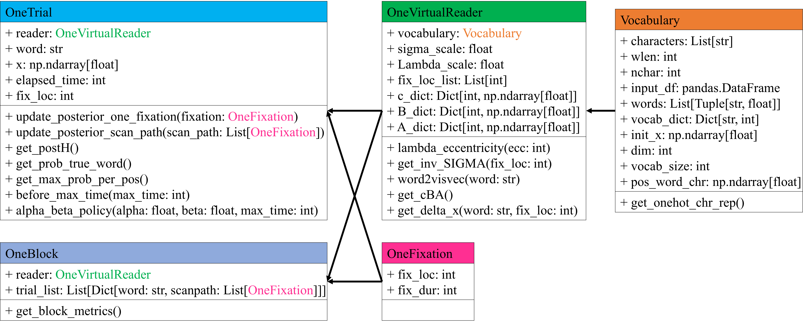
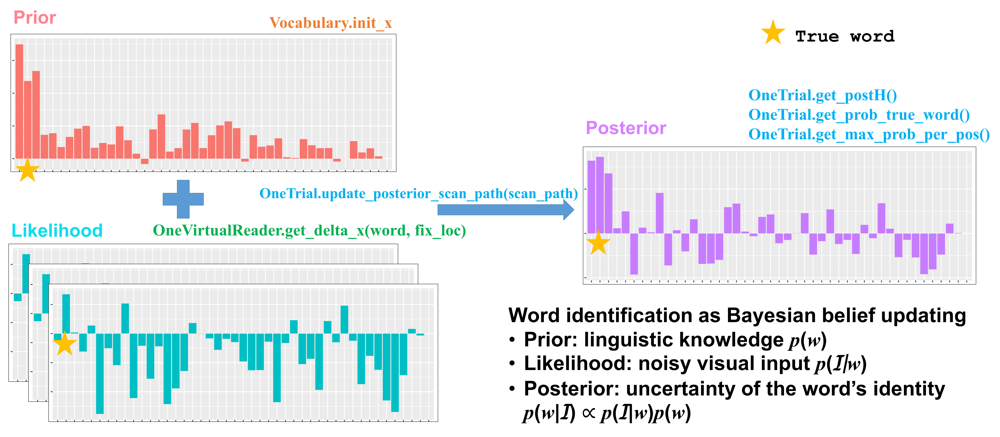

# Eye-movements-rational-model-py

A Python implementation of a rational model of eye movements for identifying a single word.

---
### I. Prerequisites
In order to run the scripts provided for demo, you need to ensure that Python 3 and the following modules are installed:  

- Python3.6+
- numpy
- pandas
- scipy

---
### II. Structure
<pre>
├── Eye-movements-rational-model-py
    ├── README.md
    ├── [DIR] images
    │   ├── EMRM_class_structure.png
    │   └── rational_model.png
    ├── requirements.txt
    ├── EMRM.py
    ├── demo.py
    ├── demoRefixation.py
    ├── demoSkipping.py
    └── [DIR] data
        ├── example_vocab.csv
        ├── example_Refixation_vocab.csv
        ├── example_Skipping_vocab.csv
        └── example_Skipping_human_fix.csv
</pre>

---
### III. Getting started
See `demo.py` for examples of basic behaviors of the model.

1. Input data: the model always requires a file that stores vocabulary information. This file should include two columns: `word` and `logfreq`. If your simulation involves comparison with existing fixation data, you may also want to include a file that stores fixation/scanpath information of each trial (e.g. `example_skip_human_fix.csv` for running `demoSkipping.py`).
2. Import classes from EMRM, and build your own `OneVirtualReader` that has its own `Vocabulary`, and can perform `OneTrial` and/or `OneBlock` of word identification task.

---
### IV. Files
##### Data
* `data/example_vocab.csv` is the input file for running `demo.py`. It contains 1,000 seven-letter words and their log-frequency sampled from 3,000 most frequent lower-case seven-letter words from [Google 1 billion word corpus](https://github.com/ciprian-chelba/1-billion-word-language-modeling-benchmark), following procedures in [this repository](https://github.com/langcomp/lm_1b).
* `data/example_Refixation_vocab.csv` is the input file for running `demoRefixation.py`. It contains 500 words and their log-frequency sampled from 5,000 most frequent lower-case words in [COCA corpus](https://www.wordfrequency.info/samples.asp).
* `data/example_Skipping_vocab.csv` is one of two input files for running `demoSkipping.py`. It contains 1,000 words and their log-frequency sampled from 20,0001 words from a corpus based on Google 1 billion word corpus and Dundee eye movement corpus, as described in [this paper](https://onlinelibrary.wiley.com/doi/full/10.1111/tops.12485).
* `data/example_Skipping_human_fix.csv` is one of two input files for running `demoSkipping.py`. It contains 20 entries of launch site and word information sampled from Dundee corpus.

##### Demos
* `demo.py` shows basic behaviors of the model.
* `demoRefixation.py` is an example of how a refixation model in [this paper](https://cogsci.mindmodeling.org/2017/papers/0067/paper0067.pdf) works (not for the purpose of replicating the whole study).
* `demoSkipping.py` is an example of how a skipping model with a frequency prior in [this paper](https://onlinelibrary.wiley.com/doi/full/10.1111/tops.12485) works (not for the purpose of replicating the whole study).

---
### V. Structure of EMRM classes

---
### VI. How the rational model of eye movements works
See [Bicknell & Levy (2010)](https://dl.acm.org/doi/10.5555/1858681.1858800), [Bicknell & Levy (2012)](http://mindmodeling.org/cogsci2012/papers/0035/paper0035.pdf), [Duan & Bicknell (2017)](https://cogsci.mindmodeling.org/2017/papers/0067/paper0067.pdf), and [Duan & Bicknell (2019)](https://onlinelibrary.wiley.com/doi/full/10.1111/tops.12485) for more details.

---
### VII. Miscellaneous
* You can set up a random seed using `np.random.seed(random_seed)` to make sure your results reproducible.
* In this model, words of different word length are handled separately. This is a simplification to make the modeling easier. Word length has complex influence on eye movements in reading, and human readers may not have perfect information about word length (see [this paper](https://www.aclweb.org/anthology/W12-1703.pdf) for more information). Given this, it's recommended that you only use the model to compare words that all have the same length.
